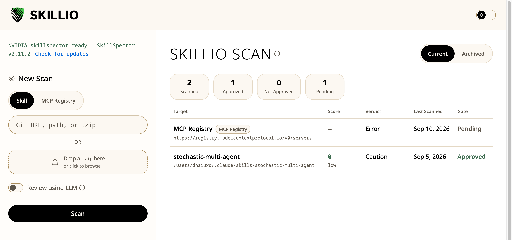

# Skillio

A local dashboard for [NVIDIA SkillSpector](https://github.com/NVIDIA/SkillSpector):
scan an agent skill or the MCP Registry, browse a history of everything you've
scanned, and approve or reject each one before you install it.

It's a thin wrapper — all the actual security analysis is done by the
`skillspector` CLI. This app gives you a browsable log instead of terminal
output you read once and lose.



> **Not affiliated with NVIDIA.** Skillio is an independent, unofficial
> front-end. **SkillSpector** is NVIDIA's tool, distributed separately under
> Apache-2.0 and installed by you — it is not bundled, modified, or
> redistributed here. Every security finding you see comes from it, not from
> this app. Names and trademarks belong to their respective owners.

## Quickstart

macOS, with [uv](https://docs.astral.sh/uv/) installed:

```bash
uv tool install git+https://github.com/NVIDIA/skillspector.git   # the scanner
git clone https://github.com/dnaiuxd/Skillio.git                 # this app
cd Skillio && ./Skillio.command                                  # first run builds the venv
```

That opens **http://localhost:8787**, and asks whether macOS should keep
Skillio running for you. Say yes and you never need a Terminal window again.

## Install

### The scanner (one-time)

SkillSpector is a separate tool; this GUI only drives it.

```bash
uv tool install git+https://github.com/NVIDIA/skillspector.git
skillspector --version
```

The rail shows *skillspector ready* when it can find it, and the exact install
command inline when it can't.

**Optional — the LLM pass.** Three semantic analyzers turn on when a provider
is set, on top of the ~20 static ones that always run. They judge whether a
skill's behaviour matches its stated purpose, which matters because a
`SKILL.md` is prose your agent obeys and malicious instructions there have no
code signature. Without a provider SkillSpector doesn't error — it quietly
returns a static-only report, and Skillio says so on the detail page.

```bash
export SKILLSPECTOR_PROVIDER=claude_cli   # reuses your Claude Code login, no API key
# or: export SKILLSPECTOR_PROVIDER=anthropic && export ANTHROPIC_API_KEY=sk-ant-...
```

### Running it

Double-click **`Skillio.command`**. The first run sets up Python, then asks
one question:

```
Hand it to macOS? [Y/n]
```

**Yes** — macOS keeps Skillio running from then on: it starts when you log
in, restarts itself if it crashes, and needs no Terminal window. This is the
one to pick. You never open `Skillio.command` again.

**No** — Skillio runs in that Terminal window and stops when you close it.
You're only asked once, but you're not stuck with it: **Run at login** at the
bottom of the left rail opens the same choice inside the app, and taking it
hands the server over there and then — the page reconnects on its own a
couple of seconds later, and you can close the Terminal window.

If it can find your Claude Code login, it also offers to switch on the
semantic analyzers — see [the LLM pass](#the-scanner-one-time) above for what
those add.

### Putting it in the Dock

Skillio opens in an ordinary browser tab until you do this once. Both
browsers build a real app from the page, and neither exposes that as anything
a script can run for you — so it's one menu item, one time:

- **Chrome** — ⋮ → *Cast, save, and share* → **Install page as app…**
- **Safari 17+** — File → **Add to Dock**

You get a Skillio icon in the Dock and a real app window: no tabs, no address
bar, no browser menus. From then on `Skillio.command` opens *that* rather
than a tab — it looks for the installed app first.

The icon is only a window, though: it opens Skillio but can't start it. That
is why the question above is worth a yes — with the background service
running, the icon always works, including straight after a restart. Without
it, clicking the icon on a freshly booted Mac gives you an error page.

<details>
<summary><b>Installing the background service by hand</b></summary>

```bash
SKILLSPECTOR_PROVIDER=claude_cli ./macos/install-service.sh
```

It builds the Python environment if there isn't one, writes the launchd agent
from wherever the repo actually lives, and starts it. The agent shows up in
System Settings > Login Items as **Skillio**. `--dry-run` shows the
plist without installing anything; `--uninstall` removes it. Logs go to
`~/Library/Logs/skillio.log`.

**Set `SKILLSPECTOR_PROVIDER` on that command** if you're not answering its
prompt. A launchd agent cannot see what you exported in a terminal, and
without it in the plist your scans silently drop to static-only. Later
re-runs carry it forward from the previous install, so a reinstall can't
quietly disable the semantic analyzers.

</details>

<details>
<summary><b>Manually</b> — when you want the reloader</summary>

```bash
cd Skillio/backend
uv venv --python '>=3.11' .venv          # or: python3 -m venv .venv
uv pip install --python .venv/bin/python -r requirements.txt
.venv/bin/uvicorn app:app --reload --port 8787
```

The backend serves the frontend, so there's nothing else to start.

</details>

## Using it

- **Scan** a git URL, a local path, or a `.zip` — or drop a `.zip` on the
  upload area. Re-scanning a source updates its row rather than duplicating
  it, so you get a fresh score after a skill's code changes.
- **Skill or MCP Registry** — a registry URL and a skill URL aren't
  distinguishable by shape, so you say which. Registry scans are slow and
  often fail partway through; see [Troubleshooting](#troubleshooting).
- **The log** shows score, verdict and gate at a glance. Risk bands come from
  SkillSpector's own `risk_assessment.severity`, so they can't drift from what
  it decided.
- **The detail view** groups findings by severity and separates three things
  that are easy to conflate: what was looked at, how fully it was read, and
  what was wrong. A short findings list is never presented as a clean one.
- **Gate** — Install / Do Not Install. Local state for your own workflow, not
  something that blocks an install elsewhere. If a re-scan comes back
  different the gate resets to pending and says why; an identical re-scan
  keeps your decision, so checking for drift costs nothing.
- **Archive** keeps a scan without it cluttering the log. Delete permanently
  is the only irreversible action.
- **Check for updates** checks both tools — your `skillspector` against
  NVIDIA's releases, and Skillio against its own. It runs only when you click
  it, and these are the only outbound calls this app makes.

## Updating

```bash
cd ~/Skillio
git pull
./macos/install-service.sh    # background service — or just reopen Skillio.command
```

Use the installer rather than `launchctl kickstart`: a bare restart picks up
new *code* but never new *dependencies*, so a release that raises a version
floor would leave the service running against the old packages.

**Your scan log survives all of this** — it lives in `backend/skillio.db`,
which is git-ignored.

## Uninstalling

```bash
cd ~/Skillio
./macos/install-service.sh --uninstall   # stops it, removes the launchd agent
rm -rf ~/Skillio                          # the app, its venv, and your scan log
rm -f ~/Library/Logs/skillio.log          # optional
```

`--uninstall` leaves your scan log alone; `rm -rf` is what deletes it. To keep
it first:

```bash
cp ~/Skillio/backend/skillio.db ~/Desktop/skillio-backup.db
```

**SkillSpector is not removed** — it's NVIDIA's tool, installed separately and
possibly used elsewhere. To remove that too: `uv tool uninstall skillspector`

Running a second checkout on another port? Its service has its own label
(`com.skillio.gui.<port>`) and is untouched by any of the above.

## Troubleshooting

**Nothing on 8787, and the log repeats "address already in use".** Something
else holds the port and the agent's `KeepAlive` restarts it forever. That loop
is not harmless: uvicorn runs the app's startup hook *before* it binds, and
that hook closes out orphaned scans — so every lap marks an in-flight scan as
failed. Stop whichever server you started by hand, or uninstall the agent.

```bash
tail ~/Library/Logs/skillio.log
launchctl list | grep skillio       # a non-zero exit status in column 2
```

**"bad interpreter" after moving the folder.** Both uv and `python3 -m venv`
write an absolute shebang into every console script, so a rename breaks
`.venv/bin/uvicorn`. `Skillio.command` detects this and rebuilds; otherwise
delete `backend/.venv` and recreate it.

**Scans come back static-only.** The provider isn't reaching the process. In a
terminal, `export SKILLSPECTOR_PROVIDER=…`; under launchd, re-run
`./macos/install-service.sh` with it set, because the agent inherits nothing
from your shell.

**A registry scan failed partway through.** Expected, and upstream. The
registry pages 30 servers at a time, so covering ~96,850 takes roughly 3,200
sequential requests — and SkillSpector abandons the whole scan on the first
network hiccup rather than retrying that page. Over that many requests one
hiccup is close to certain. The failure is recorded on the row like any other,
so nothing is corrupted; re-running is the only remedy from this side.

## More

- **[docs/NOTES.md](docs/NOTES.md)** — how it works and why: streaming a
  256 MB registry report, what the gate fingerprint actually hashes, the
  report shapes the parser targets, theming and accessibility decisions.
- **[CONTRIBUTING.md](CONTRIBUTING.md)** — tests, releasing, and running two
  checkouts side by side.

## License

[MIT](LICENSE) — do what you like with it, keep the copyright notice.

Two things it doesn't cover:

- **SkillSpector is not bundled here.** It's a separate NVIDIA tool under
  Apache-2.0 that you install yourself; this app invokes it as a subprocess.
  Its licence governs it, not this repo.
- **The bundled fonts keep their own licences** — see
  `frontend/fonts/LICENSE-*.txt` (OFL for both). MIT covers the code, not the
  typefaces.
